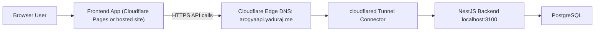

# Cloudflare Tunnel Deployment Guide (Aarogya360 API)

This guide publishes your local backend to the internet at:

- `https://arogyaapi.yaduraj.me`

It also configures frontend-to-backend communication for hosted portal usage.

## Architecture (Visual)



## 1) Pre-checks

1. Domain `yaduraj.me` must be managed in Cloudflare.
2. Backend runs locally on `http://localhost:3100`.
3. Node dependencies installed:

```bash
cd /Users/sujeetkumarsingh/Desktop/MedLifeCycle/backend
npm install
```

## 2) Install and Authenticate `cloudflared`

macOS:

```bash
brew install cloudflared
```

Check:

```bash
cloudflared --version
```

Authenticate Cloudflare account:

```bash
cloudflared tunnel login
```

## 3) Create Tunnel + Map Custom Hostname

Create named tunnel (one-time):

```bash
cloudflared tunnel create medlifecycle-api
```

Map DNS hostname to this tunnel:

```bash
cloudflared tunnel route dns medlifecycle-api arogyaapi.yaduraj.me
```

Confirm tunnel:

```bash
cloudflared tunnel list
cloudflared tunnel info medlifecycle-api
```

## 4) Tunnel Config File

Create `~/.cloudflared/config.yml`:

```yaml
tunnel: medlifecycle-api
credentials-file: /Users/<YOUR_USER>/.cloudflared/<TUNNEL_ID>.json

ingress:
  - hostname: arogyaapi.yaduraj.me
    service: http://localhost:3100
  - service: http_status:404
```

Notes:

- Replace `<YOUR_USER>` with your macOS username.
- Replace `<TUNNEL_ID>` with the UUID JSON created by `cloudflared tunnel create`.

Validate config:

```bash
cloudflared tunnel ingress validate
```

## 5) Backend Production Env for Hosted Access

Update `/Users/sujeetkumarsingh/Desktop/MedLifeCycle/backend/.env` with hosted-safe values:

```env
PORT=3100
PUBLIC_API_BASE_URL=https://arogyaapi.yaduraj.me

# Add your frontend domain(s) here
CORS_ALLOWED_ORIGINS=https://<YOUR_FRONTEND_DOMAIN>,https://<YOUR_OTHER_DOMAIN_IF_ANY>

# For same-site subdomains under yaduraj.me
COOKIE_DOMAIN=.yaduraj.me
COOKIE_SAME_SITE=lax
```

If frontend is on a different site (for example `*.pages.dev`), use:

```env
COOKIE_DOMAIN=
COOKIE_SAME_SITE=none
```

(`none` requires HTTPS and secure cookies.)

## 6) Start Backend + Tunnel

Terminal A (backend):

```bash
cd /Users/sujeetkumarsingh/Desktop/MedLifeCycle/backend
npx prisma migrate deploy
npm run start:dev
```

Terminal B (tunnel):

```bash
cloudflared tunnel run medlifecycle-api
```

Now your API should be reachable at:

- `https://arogyaapi.yaduraj.me/api`

## 7) Frontend Production Configuration

Set frontend production env:

```env
VITE_API_BASE_URL=https://arogyaapi.yaduraj.me/api
VITE_APP_ENV=production
```

Build frontend:

```bash
cd /Users/sujeetkumarsingh/Desktop/MedLifeCycle/landing_page
npm install
npm run build
```

## 8) Optional: Deploy Frontend to Cloudflare Pages

Authenticate Wrangler:

```bash
npx wrangler whoami
```

If needed:

```bash
npx wrangler login
```

Deploy `dist`:

```bash
cd /Users/sujeetkumarsingh/Desktop/MedLifeCycle/landing_page
npx wrangler pages deploy dist --project-name aarogya360-portal
```

Then add custom domain in Cloudflare Pages dashboard (recommended: subdomain of `yaduraj.me`).

## 9) Verification Checklist

Backend health (if endpoint exists):

```bash
curl -i https://arogyaapi.yaduraj.me/api
```

Auth route reachability:

```bash
curl -i https://arogyaapi.yaduraj.me/api/auth/refresh
```

Frontend should:

1. open portal login,
2. log in successfully,
3. call API without CORS error,
4. load avatars/profile images (now deployment-safe),
5. refresh session via HttpOnly cookie.

## 10) Common Issues

1. `401` on refresh:
   - Cookie settings mismatch (`COOKIE_SAME_SITE`, `COOKIE_DOMAIN`).
2. CORS blocked:
   - `CORS_ALLOWED_ORIGINS` missing exact frontend origin.
3. Tunnel connected but 502:
   - Local backend not running on expected port.
4. Avatars broken on hosted frontend:
   - Set `PUBLIC_API_BASE_URL=https://arogyaapi.yaduraj.me`.

