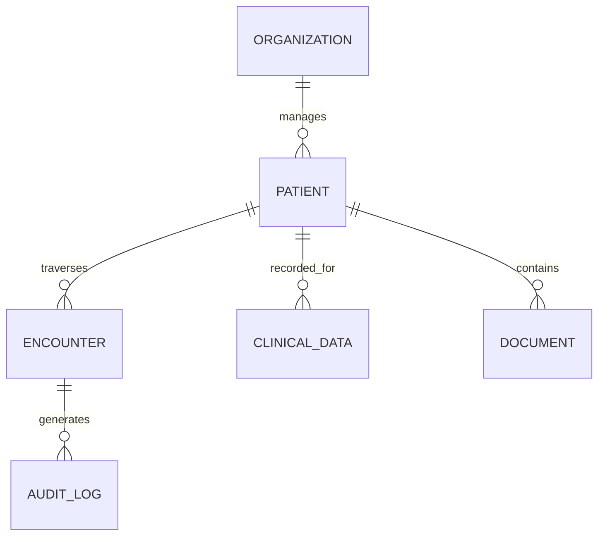

# MedLifeCycle: Database Schema (Local Edition)

The schema is optimized for **PostgreSQL** with a focus on FHIR compliance and local performance.

## 1. Core Schema Overview
The database uses a single-database, multi-tenant approach with Row-Level Security (RLS) and JSONB for flexibility.

## 2. Key Tables

### `patients`
| Column | Type | Description |
| :--- | :--- | :--- |
| `id` | UUID | Primary Key |
| `org_id` | UUID | Link to Hospital/Practice |
| `fhir_resource` | JSONB | Complete patient demographics |
| `lifecycle_stage`| INT | Current stage (1-10) |

### `documents`
| Column | Type | Description |
| :--- | :--- | :--- |
| `id` | UUID | Primary Key |
| `patient_id` | UUID | FK to Patient |
| `file_path` | TEXT | Local path on disk |
| `ai_metadata` | JSONB | Extraction results and flags |

### `clinical_events`
| Column | Type | Description |
| :--- | :--- | :--- |
| `id` | UUID | Primary Key |
| `type` | ENUM | LAB, VITAL, MEDICATION |
| `content` | JSONB | FHIR-compliant record |

## 3. High-Performance Search
We use `pgvector` to store document embeddings locally. This allows the AI to perform "semantic search" (finding related medical concepts) without sending the entire patient record to an external LLM for every query.
