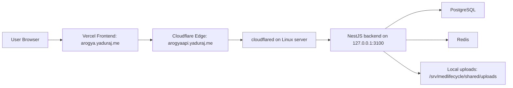

# Linux Server Backend Deployment Guide

This guide is for the production topology:

- Frontend: `https://arogya.yaduraj.me` on Vercel
- API: `https://arogyaapi.yaduraj.me/api` via Cloudflare Tunnel
- Backend runtime: NestJS on your Linux server at `127.0.0.1:3100`
- Data layer: PostgreSQL + Redis on the same server

## Final API Endpoint

Use this API base URL everywhere:

- `https://arogyaapi.yaduraj.me/api`

Frontend production env on Vercel:

```env
VITE_API_BASE_URL=https://arogyaapi.yaduraj.me/api
VITE_APP_ENV=production
```

## Architecture



## Directory Layout

Use this on the Linux server:

```text
/srv/medlifecycle/
  backend/
  shared/
    uploads/
  backups/
/etc/medlifecycle/
  backend.env
/etc/default/
  cloudflared-medlifecycle-api
```

## 1) Server Base Packages

Ubuntu/Debian:

```bash
sudo apt update
sudo apt install -y curl git ca-certificates gnupg lsb-release unzip
```

## 2) Install Node.js 20

```bash
curl -fsSL https://deb.nodesource.com/setup_20.x | sudo -E bash -
sudo apt install -y nodejs
node -v
npm -v
```

## 3) Create Application User and Directories

```bash
sudo useradd --system --create-home --shell /bin/bash medlifecycle
sudo mkdir -p /srv/medlifecycle/backend
sudo mkdir -p /srv/medlifecycle/shared/uploads
sudo mkdir -p /srv/medlifecycle/backups
sudo mkdir -p /etc/medlifecycle
sudo chown -R medlifecycle:medlifecycle /srv/medlifecycle
sudo chmod 750 /srv/medlifecycle
sudo chmod 750 /srv/medlifecycle/shared/uploads
```

## 4) Install Docker for PostgreSQL and Redis

```bash
sudo apt install -y docker.io docker-compose-plugin
sudo systemctl enable --now docker
sudo usermod -aG docker medlifecycle
```

## 5) Upload or Clone Project Code

If using git on server:

```bash
sudo -u medlifecycle git clone <YOUR_REPO_URL> /srv/medlifecycle/backend
```

If copying from your local machine:

```bash
rsync -av --delete /Users/sujeetkumarsingh/Desktop/MedLifeCycle/backend/ <server-user>@<server-ip>:/tmp/medlifecycle-backend/
ssh <server-user>@<server-ip>
sudo rsync -av --delete /tmp/medlifecycle-backend/ /srv/medlifecycle/backend/
sudo chown -R medlifecycle:medlifecycle /srv/medlifecycle/backend
```

## 6) Prepare Production Environment File

Start from:

- [backend.production.env.example](/Users/sujeetkumarsingh/Desktop/MedLifeCycle/backend/deploy/env/backend.production.env.example)

Install to server:

```bash
sudo cp /srv/medlifecycle/backend/deploy/env/backend.production.env.example /etc/medlifecycle/backend.env
sudo chown root:root /etc/medlifecycle/backend.env
sudo chmod 600 /etc/medlifecycle/backend.env
sudo nano /etc/medlifecycle/backend.env
```

Minimum values to change:

- `DATABASE_URL`
- `JWT_SECRET`
- `ENCRYPTION_KEY`
- webhook/token settings if you use them

Required production values already aligned to your domains:

- `PUBLIC_API_BASE_URL=https://arogyaapi.yaduraj.me`
- `CORS_ALLOWED_ORIGINS=https://arogya.yaduraj.me`
- `COOKIE_DOMAIN=.yaduraj.me`
- `COOKIE_SAME_SITE=lax`

## 7) Start PostgreSQL and Redis

From the backend directory:

```bash
cd /srv/medlifecycle/backend
sudo docker compose up -d
sudo docker compose ps
```

## 8) Install Backend Dependencies and Build

```bash
cd /srv/medlifecycle/backend
sudo -u medlifecycle npm install
sudo -u medlifecycle npx prisma generate
sudo -u medlifecycle npx prisma migrate deploy
sudo -u medlifecycle npm run build
```

## 9) Install Backend systemd Service

Template file:

- [medlifecycle-backend.service](/Users/sujeetkumarsingh/Desktop/MedLifeCycle/backend/deploy/systemd/medlifecycle-backend.service)

Install it:

```bash
sudo cp /srv/medlifecycle/backend/deploy/systemd/medlifecycle-backend.service /etc/systemd/system/medlifecycle-backend.service
sudo systemctl daemon-reload
sudo systemctl enable --now medlifecycle-backend
sudo systemctl status medlifecycle-backend
```

Logs:

```bash
sudo journalctl -u medlifecycle-backend -f
```

## 10) Install cloudflared

```bash
curl -fsSL https://pkg.cloudflare.com/cloudflare-main.gpg | sudo gpg --dearmor -o /usr/share/keyrings/cloudflare-main.gpg
echo "deb [signed-by=/usr/share/keyrings/cloudflare-main.gpg] https://pkg.cloudflare.com/cloudflared any main" | sudo tee /etc/apt/sources.list.d/cloudflared.list
sudo apt update
sudo apt install -y cloudflared
cloudflared --version
```

## 11) Create Tunnel and Map API Hostname

Run once from a machine where you can authenticate to Cloudflare:

```bash
cloudflared tunnel login
cloudflared tunnel create medlifecycle-api
cloudflared tunnel route dns medlifecycle-api arogyaapi.yaduraj.me
cloudflared tunnel token medlifecycle-api
```

Copy the printed token.

## 12) Install cloudflared systemd Service on Server

Template file:

- [cloudflared-medlifecycle-api.service](/Users/sujeetkumarsingh/Desktop/MedLifeCycle/backend/deploy/systemd/cloudflared-medlifecycle-api.service)

Create token env file:

```bash
echo 'TUNNEL_TOKEN=PASTE_THE_TOKEN_HERE' | sudo tee /etc/default/cloudflared-medlifecycle-api
sudo chmod 600 /etc/default/cloudflared-medlifecycle-api
```

Install and start service:

```bash
sudo cp /srv/medlifecycle/backend/deploy/systemd/cloudflared-medlifecycle-api.service /etc/systemd/system/cloudflared-medlifecycle-api.service
sudo systemctl daemon-reload
sudo systemctl enable --now cloudflared-medlifecycle-api
sudo systemctl status cloudflared-medlifecycle-api
```

Tunnel logs:

```bash
sudo journalctl -u cloudflared-medlifecycle-api -f
```

## 13) Verify Public API

From anywhere:

```bash
curl -i https://arogyaapi.yaduraj.me/api
curl -i https://arogyaapi.yaduraj.me/api/auth/refresh
```

From the server itself:

```bash
curl -i http://127.0.0.1:3100/api
```

## 14) Configure Vercel Frontend

Set these environment variables in Vercel:

```env
VITE_API_BASE_URL=https://arogyaapi.yaduraj.me/api
VITE_APP_ENV=production
```

Then redeploy the frontend.

## 15) Update Workflow

For each backend release:

```bash
ssh <server-user>@<server-ip>
cd /srv/medlifecycle/backend
sudo -u medlifecycle git pull
sudo -u medlifecycle npm install
sudo -u medlifecycle npx prisma migrate deploy
sudo -u medlifecycle npm run build
sudo systemctl restart medlifecycle-backend
sudo systemctl status medlifecycle-backend
```

## 16) Operational Checks

Check backend:

```bash
sudo systemctl status medlifecycle-backend
sudo journalctl -u medlifecycle-backend -n 200 --no-pager
```

Check tunnel:

```bash
sudo systemctl status cloudflared-medlifecycle-api
sudo journalctl -u cloudflared-medlifecycle-api -n 200 --no-pager
```

Check containers:

```bash
cd /srv/medlifecycle/backend
sudo docker compose ps
sudo docker compose logs postgres
sudo docker compose logs redis
```

## 17) Notes

- You do not need Nginx for this topology unless you want extra internal reverse proxying.
- Keep the NestJS backend bound internally; Cloudflare Tunnel is the public entrypoint.
- Your API endpoint should stay `https://arogyaapi.yaduraj.me/api`.
- Your frontend should stay `https://arogya.yaduraj.me`.
