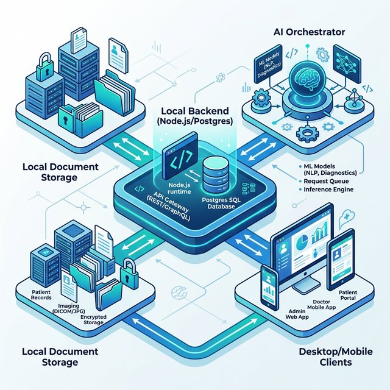
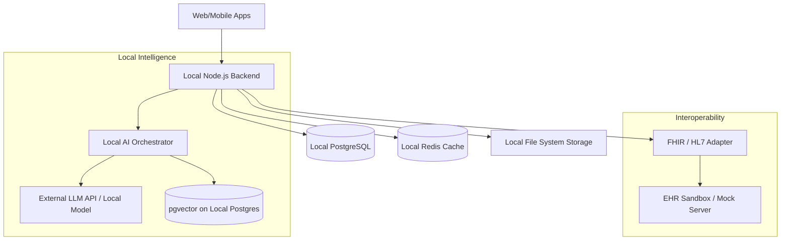

# MedLifeCycle: Local Backend Architecture

This document describes the technical architecture for running the MedLifeCycle backend locally on a laptop for development and demonstration purposes.

## 1. High-Level Design (Local-First)

Instead of relying on cloud providers (AWS), we use a containerized or direct-run approach to ensure the entire system can be hosted on a single machine.

## 2. Component Adaptation (Cloud vs. Local)

| Cloud Component | Local Equivalent | Implementation Notes |
| :--- | :--- | :--- |
| **AWS RDS (Postgres)** | **Local PostgreSQL** | Installed via Homebrew or Docker. Using `pgvector` for AI search. |
| **AWS S3** | **Local File System** | Stored in `/data/attachments` with local AES-256 encryption. |
| **AWS Cognito** | **Passport.js / Supabase Local** | Local JWT-based authentication with simulated MFA. |
| **AWS SNS/SQS** | **BullMQ / Redis Streams** | Running within the local Redis instance for background tasks. |
| **AWS EKS (Kubernetes)** | **Docker Compose** | Orchestrating containers (Node, Postgres, Redis) in a single stack. |

## 3. Storage Strategy
Medical documents are stored in a dedicated directory on the laptop's disk. 
- **Path:** `./storage/documents`
- **Security:** Files are encrypted at the application layer before being written to disk.
- **Audit Logs:** Written to a local `audit.log` file which is mirrored to a protected SQL table.

## 4. AI Orchestration
The "AI Assistant" runs as a service within the Node.js backend:
1. **Context Construction:** Queries local Postgres for patient history.
2. **Document Retrieval:** Uses `pgvector` on the local database to find relevant medical snippets.
3. **Inference:** Communicates via API to a powerful LLM (e.g., OpenAI/Anthropic) or runs a quantized model (e.g., Llama 3 via Ollama) locally if hardware permits.
